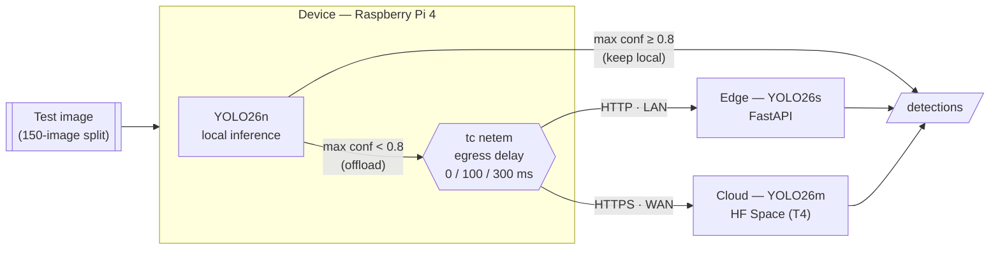
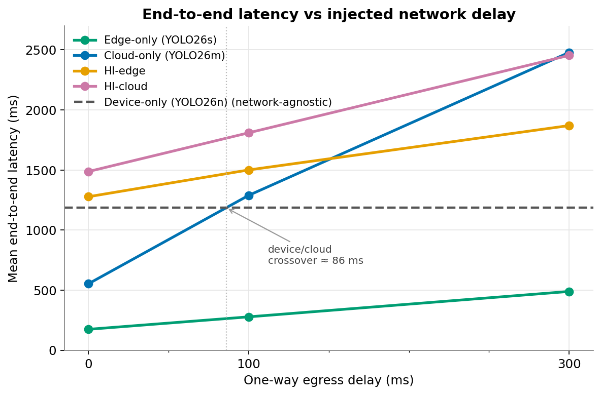
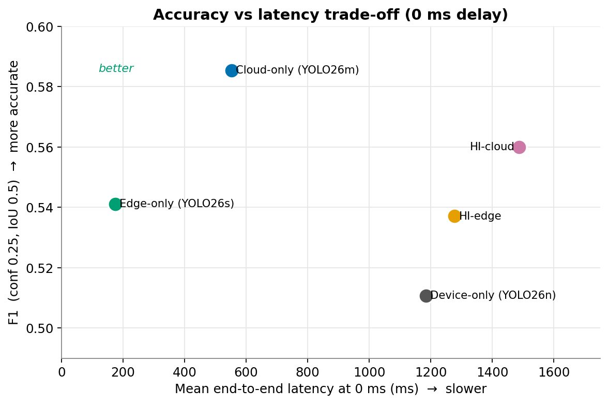
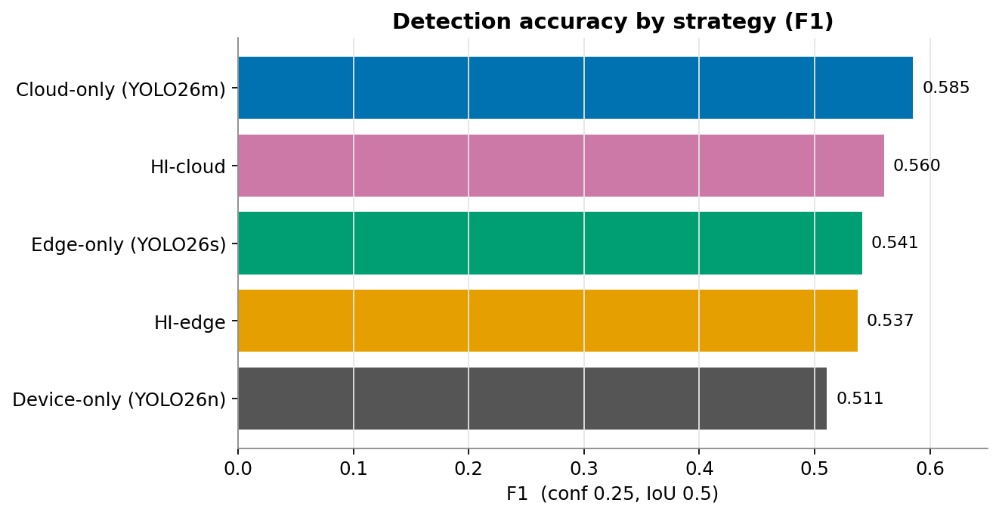
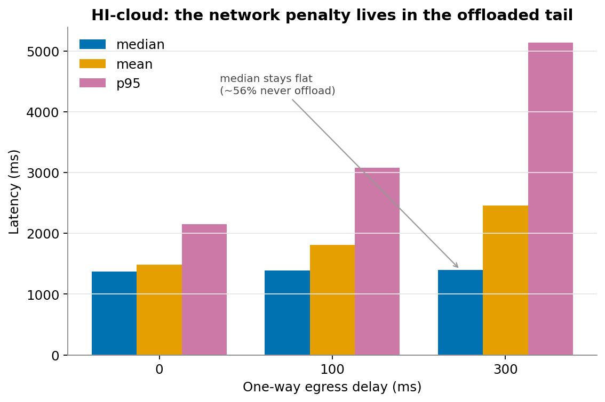

# Litter Detection Inference Benchmarks

**Benchmarking ML inference strategies across the IoT–edge–cloud continuum under emulated
network latency — a smart-city litter-detection case study.**

TU Wien MSc thesis. The study compares five inference strategies for detecting litter in
street-level images across a three-tier **device → edge → cloud** system, and asks _under
what network conditions each strategy is preferable_. The unit of analysis is the
inference **strategy** (a systems-level benchmark), not the internals of any single tier.

---

## Overview

A single YOLO26 detector is deployed at three tiers of increasing capability, and images
from a fixed test set are run through five strategies while network latency is injected on
the device's uplink. For each strategy we measure end-to-end latency, detection accuracy,
bytes transferred, and — for the hierarchical strategies — how often work is offloaded.

| Tier       | Hardware                                      | Model   | Serving                   |
| ---------- | --------------------------------------------- | ------- | ------------------------- |
| **Device** | Raspberry Pi 4                                | YOLO26n | local (`ultralytics`)     |
| **Edge**   | Lenovo Mini PC (Ubuntu 24.04 LXC via Proxmox) | YOLO26s | FastAPI / uvicorn (HTTP)  |
| **Cloud**  | Hugging Face Space (NVIDIA T4 GPU)            | YOLO26m | FastAPI / uvicorn (HTTPS) |



### Inference strategies

| Strategy        | Description                                                                           |
| --------------- | ------------------------------------------------------------------------------------- |
| **device-only** | Full inference on the Pi (YOLO26n)                                                    |
| **edge-only**   | Every image offloaded to the edge server (YOLO26s)                                    |
| **cloud-only**  | Every image offloaded to the cloud Space (YOLO26m)                                    |
| **HI-edge**     | Run YOLO26n on the device; offload to the **edge** if device max confidence &lt; 0.8  |
| **HI-cloud**    | Run YOLO26n on the device; offload to the **cloud** if device max confidence &lt; 0.8 |

**HI** = _hierarchical inference_. Low-confidence images pay a **double inference cost**
(device + remote). Images with zero device detections have max confidence 0.0 and
therefore always offload.

### Dataset & models

- **[TACO](https://github.com/pedropro/TACO)** (Trash Annotations in Context), converted to
  YOLO format and collapsed to a **single `litter` class**.
- 80/10/10 train/val/test split (`seed=42`); a **fixed 150-image test split** is used
  identically across every configuration.
- **5 repeated runs** per (strategy, latency) cell → **750 latency samples** per cell.

The three tier models are fine-tuned YOLO26 variants (training-side validation metrics on
the same 150-image test split, `ultralytics val`):

| Model   | Params | GFLOPs | mAP50 | mAP50-95 | Precision | Recall |
| ------- | -----: | -----: | ----: | -------: | --------: | -----: |
| YOLO26n |  2.4 M |    5.2 | 0.477 |    0.334 |     0.676 |  0.415 |
| YOLO26s |  9.5 M |   20.5 | 0.519 |    0.365 |     0.683 |  0.453 |
| YOLO26m | 20.4 M |   67.8 | 0.542 |    0.384 |     0.716 |  0.482 |

> **Note:** these `mAP` figures are **training-side** metrics and are **not** the benchmark
> accuracy below. The benchmark reports single-operating-point **precision/recall/F1 at
> conf 0.25, IoU 0.5** — a different metric. The two must not be mixed.

---

## Results

All numbers are from the final validated benchmark run (5 repeats × 150 images,
**0 failed requests**). Accuracy is deterministic and therefore identical across repeats
and latency levels; only latency varies. Injected delay is **one-way egress (uplink) delay,
not round-trip time**.

### Latency vs network delay



Edge-only stays fastest at every delay and scales roughly linearly. Cloud-only grows
**super-linearly** (TLS + TCP slow-start over the WAN). Device-only is network-agnostic
(constant) and overtakes cloud-only at roughly **86 ms** one-way delay.

### Accuracy vs latency trade-off (0 ms)



At the baseline, **edge-only** sits in the sweet spot (low latency, solid F1),
**cloud-only** buys the highest accuracy at ~3× the latency, and **device-only** is
dominated — the slowest single-tier option _and_ the least accurate.

### Detection accuracy by strategy



### Where the network penalty lands (HI-cloud)



Because ~56% of images never leave the device, HI-cloud's **median** latency is nearly flat
across delay while the **mean** rises and **p95** explodes — the entire network penalty
lives in the offloaded tail. This is the argument for reporting median/p95, not just mean.

### Summary table

| Strategy | Delay (ms) | Mean (ms) | Median (ms) | p95 (ms) | Precision | Recall |    F1 | Offload |
| -------- | ---------: | --------: | ----------: | -------: | --------: | -----: | ----: | ------: |
| edge     |          0 |     174.0 |       168.8 |    252.9 |     0.620 |  0.480 | 0.541 |       — |
| edge     |        100 |     277.7 |       268.8 |    405.9 |     0.620 |  0.480 | 0.541 |       — |
| edge     |        300 |     489.0 |       469.2 |    804.6 |     0.620 |  0.480 | 0.541 |       — |
| cloud    |          0 |     553.1 |       541.8 |    821.3 |     0.720 |  0.493 | 0.585 |       — |
| cloud    |        100 |    1288.8 |      1287.1 |   2115.9 |     0.720 |  0.493 | 0.585 |       — |
| cloud    |        300 |    2478.0 |      2580.2 |   3755.5 |     0.720 |  0.493 | 0.585 |       — |
| device   |          0 |    1184.7 |      1202.4 |   1492.1 |     0.675 |  0.411 | 0.511 |       — |
| HI-edge  |          0 |    1277.5 |      1261.1 |   1667.9 |     0.664 |  0.451 | 0.537 |    0.44 |
| HI-edge  |        100 |    1500.3 |      1310.4 |   2315.3 |     0.664 |  0.451 | 0.537 |    0.44 |
| HI-edge  |        300 |    1869.6 |      1377.3 |   3767.3 |     0.664 |  0.451 | 0.537 |    0.44 |
| HI-cloud |          0 |    1487.2 |      1371.0 |   2152.2 |     0.723 |  0.457 | 0.560 |    0.44 |
| HI-cloud |        100 |    1809.5 |      1387.1 |   3079.7 |     0.723 |  0.457 | 0.560 |    0.44 |
| HI-cloud |        300 |    2453.7 |      1397.7 |   5137.9 |     0.723 |  0.457 | 0.560 |    0.44 |

### Key findings

- **Baseline trade-offs (0 ms).** Edge-only is fastest by a wide margin (174 ms,
  F1 0.541); cloud-only is most accurate (F1 0.585, 553 ms); device-only is dominated on
  both axes. Offloading to the edge beats local inference outright.
- **Latency crossover.** Edge scales linearly and is never overtaken. Cloud scales
  super-linearly and is overtaken by constant device-only latency at **≈ 86 ms** one-way
  delay.
- **Hierarchical effectiveness.** HI improves accuracy over device-only
  (HI-cloud 0.560 vs 0.511) but is **dominated by pure offloading** on both latency and
  accuracy here, because the edge is cheap to reach. HI's real advantage is **network
  cost**: it transmits only 44% of images (~56% fewer than always-offloading) while
  recovering most of the accuracy gain — a _bandwidth / offload-volume_ optimization,
  rather than a latency or accuracy winner.

The figures above summarize the aggregated results in
[`results/summary.csv`](results/summary.csv).

---

## Repository structure

```
.
├── data/                          # test split goes here (not shipped — see Reproducing)
├── docs/figures/                  # result figures shown in this README
├── models/                        # weights yolo26{n,s,m}.pt go here (not shipped) + README
├── notebooks/                     # Colab notebook used to fine-tune the models
├── results/summary.csv            # aggregated benchmark results (source for the figures)
├── scripts/                       # benchmark orchestration + netem shaping
│   ├── benchmark.sh               # official one-command benchmark (run on the Pi)
│   ├── run_grid.sh                # strategy × latency × runs grid driver
│   └── set_netem.sh               # tc netem egress-delay injection
├── src/
│   ├── benchmark/                 # runner, aggregate, config
│   ├── device/                    # Pi client: strategy dispatch + HI offload logic
│   ├── inference/                 # shared YOLO wrapper + FastAPI server factory
│   ├── edge/  cloud/              # tier entrypoints (uvicorn apps)
│   └── utils/                     # accuracy metrics (IoU, precision/recall/F1)
└── tests/                         # unit tests for the accuracy metric
```

---

## Reproducing

### 1. Get the models and test data

Neither the fine-tuned weights nor the TACO test split are shipped in this repo — both are
produced by the Colab notebook in [`notebooks/`](notebooks/).

**Models.** The notebook fine-tunes each YOLO26 variant and writes the best checkpoint to
Google Drive at `litter_detection/<model>/weights/best.pt`. Download the three and place them
in `models/` with these exact names (referenced by [`src/benchmark/config.py`](src/benchmark/config.py)
and the edge/cloud apps):

```text
models/
├── yolo26n.pt   # Device tier
├── yolo26s.pt   # Edge tier
└── yolo26m.pt   # Cloud tier
```

**Test data.** The notebook also downloads [TACO](https://github.com/pedropro/TACO), converts
it to a single-class YOLO dataset, and exports the fixed 150-image test split as
`taco_test.zip`. Unzip that into `data/` so the layout matches `config.py`:

```text
data/content/taco_yolo/test/
├── images/   # 150 .jpg images
└── labels/   # 150 YOLO .txt labels
```

### 2. Serve the edge and cloud tiers

Each tier runs on its own machine; both expose `/health` and `/infer` on port 8000.

```bash
# on the edge machine
pip install -r src/edge/requirements.txt
python -m src.edge.app      # YOLO26s — serves /health and /infer on :8000

# on the cloud host (e.g. a Hugging Face Space)
pip install -r src/cloud/requirements.txt
python -m src.cloud.app     # YOLO26m — serves /health and /infer on :8000
```

The device client points at the tiers via environment variables (defaulting to
`localhost`):

```bash
export EDGE_INFER_URL=http://<edge-ip>:8000/infer
export CLOUD_INFER_URL=https://<your-space>.hf.space/infer
```

### 3. Run the benchmark (on the Raspberry Pi)

`tc netem` shaping requires passwordless `tc`; the driver injects one-way egress delay,
runs the full `strategy × {0,100,300} ms × 5` grid, verifies the output, and aggregates:

```bash
bash scripts/benchmark.sh
```

`netem` shapes a single interface, auto-detected from the Pi's default route. If the Pi is
multi-homed and the offload traffic to the edge/cloud leaves over a _different_ interface
than the default route, shape that one explicitly — otherwise the injected delay lands on a
path the benchmark never uses and has no effect:

```bash
BENCHMARK_IFACE=wlan0 bash scripts/benchmark.sh
```

Each run directory contains the per-image CSVs plus `manifest.txt` (package versions),
`netem_log.txt`, and `system_log.txt` for reproducibility.

### 4. Analyze

```bash
python -m src.benchmark.aggregate --input-dir results/<run-dir>   # summary.csv + table
pytest tests/                                                     # accuracy-metric unit tests
```

---

## License & citation

Academic work produced for a TU Wien MSc thesis. Please cite the thesis if you use this
benchmark or its results. The TACO dataset is © its respective authors — see the
[TACO repository](https://github.com/pedropro/TACO) for its license and terms.
